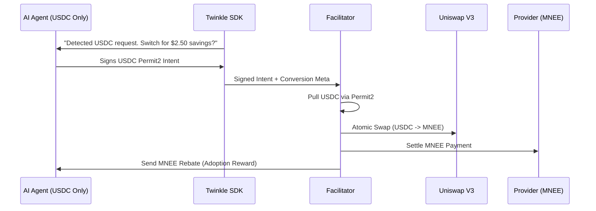

# ✨ Twinkle SDK: The Universal MNEE Adoption Engine

> **Powering Agentic Commerce with Gasless MNEE Settlement & Native Monetization.**

[](https://www.npmjs.com/package/twinkle-sdk)
[](https://opensource.org/licenses/MIT)

**🌐 Website:** [tw1nkl3.rest](https://tw1nkl3.rest) | **📦 NPM:** [twinkle-sdk](https://www.npmjs.com/package/twinkle-sdk) | **📚 Docs:** [tw1nkl3.rest/docs](https://tw1nkl3.rest/docs)

Twinkle is an Institutional-Grade SDK for the **x402 (Payment Required)** ecosystem. It provides AI agents with the ability to discover, negotiate, and settle payments gaslessly using **MNEE** (The Agentic Stablecoin), while offering a seamless "Universal Bridge" for legacy USDC users.

---

## 🚀 Quick Start

### Installation

```bash
npm install twinkle-sdk
```

### For AI Agents

```typescript
import { TwinkleAgent } from "twinkle-sdk";

const agent = new TwinkleAgent({
  privateKey: process.env.AGENT_PRIVATE_KEY,
  providerUrl: "https://rpc.ankr.com/eth",
  developerAddress: "0xYourDevWallet",
  autoSwitch: true, // Enable USDC → MNEE bridge
});

// Fetch any x402-protected resource - payments are handled automatically
const result = await agent.fetch("https://premium-agent-service.com/api");
```

### For API Providers

```typescript
import express from "express";
import { TwinkleServer } from "twinkle-sdk";

const app = express();

const twinkle = new TwinkleServer({
  price: "0.01",
  currency: "MNEE",
  destinationAddress: "0xYourWallet",
  facilitatorAddress: "0xFacilitator",
});

app.get("/api/premium", twinkle.middleware(), (req, res) => {
  res.json({ message: "Content unlocked via gasless MNEE!" });
});
```

---

## 🏛️ Institutional Architecture


---

## ⚡ Key Advantages

| Feature          | Twinkle (MNEE)                    | Traditional (USDC)          |
| :--------------- | :-------------------------------- | :-------------------------- |
| **Gas Cost**     | **Gasless** (Facilitator Covered) | Heavy (Approval + Transfer) |
| **UX Flow**      | **Atomic** (Signature only)       | Complex (Multi-step)        |
| **Monetization** | **Native 5% Dev Fee**             | Manual/Social Layer         |
| **Onboarding**   | **Instant Bridge** (USDC/MNEE)    | Friction-Heavy              |
| **Loyalty**      | **Automated Rebates**             | None                        |

---

## 🐳 Running the Facilitator (Docker)

The Facilitator is the relay node that executes gasless transactions on behalf of agents.

### Prerequisites

- Docker & Docker Compose installed
- An Ethereum wallet with ETH for gas (the Facilitator wallet)
- RPC endpoint (e.g., Alchemy, Infura, or Ankr)

### Setup

1. **Clone the repository:**

```bash
git clone https://github.com/akash-mondal/twinkle.git
cd twinkle
```

2. **Create your environment file:**

```bash
cp .env.example .env
```

3. **Configure `.env`:**

```env
RPC_URL=https://rpc.ankr.com/eth
FACILITATOR_PRIVATE_KEY=0xYourFacilitatorPrivateKey
```

4. **Start the Facilitator:**

```bash
docker-compose up -d
```

5. **Verify it's running:**

```bash
curl http://localhost:3000/health
```

### Docker Compose Configuration

```yaml
version: "3.8"

services:
  facilitator:
    build: .
    container_name: twinkle-facilitator
    restart: always
    environment:
      - FACILITATOR_PRIVATE_KEY=${FACILITATOR_PRIVATE_KEY}
      - RPC_URL=${RPC_URL:-https://rpc.ankr.com/eth}
      - PORT=3000
    ports:
      - "3000:3000"
    volumes:
      - ./.env:/app/.env
    networks:
      - twinkle-net

networks:
  twinkle-net:
    driver: bridge
```

---

## 🔗 The Universal Bridge (Swap-Relay)

Twinkle features a first-of-its-kind **Universal Bridge** that captures legacy USDC traffic and settles natively in MNEE. When a service provider requests USDC, the SDK provides the agent with a "Migration Quote"—showing the gas savings and loyalty rebates gained by switching to MNEE.


```mermaid
sequenceDiagram
    participant Agent as AI Agent (USDC Only)
    participant SDK as Twinkle SDK
    participant Fac as Facilitator
    participant DEX as Uniswap V3
    participant Provider as Provider (MNEE)

    SDK->>Agent: "Detected USDC request. Switch for $2.50 savings?"
    Agent->>SDK: Signs USDC Permit2 Intent
    SDK->>Fac: Signed Intent + Conversion Meta
    Fac->>Fac: Pull USDC via Permit2
    Fac->>DEX: Atomic Swap (USDC -> MNEE)
    Fac->>Provider: Settle MNEE Payment
    Fac->>Agent: Send MNEE Rebate (Adoption Reward)
```

---

## 💎 Developer Monetization

Twinkle enforces a native **5% developer fee split** on all transactions.

- **Provider**: Receives 95% of the service price.
- **Developer**: Receives 5% royalty for building the agent/integration.
- **Agent**: Receives a gasless experience + optional loyalty rebates.

---

## 📦 API Reference

### `TwinkleAgent`

The client SDK for AI agents making payments.

```typescript
import { TwinkleAgent, AgentConfig } from 'twinkle-sdk';

const config: AgentConfig = {
  privateKey: string;        // Agent's private key
  providerUrl: string;       // Ethereum RPC URL
  developerAddress: string;  // Address to receive 5% dev fees
  autoSwitch?: boolean;      // Enable USDC→MNEE bridge (default: true)
  dashboardId?: string;      // Optional telemetry ID
};

const agent = new TwinkleAgent(config);
await agent.fetch(url, options);
```

### `TwinkleServer`

Express middleware for monetizing API endpoints.

```typescript
import { TwinkleServer, ServerConfig } from 'twinkle-sdk';

const config: ServerConfig = {
  price: string;              // Price in token units (e.g., "0.01")
  currency: string;           // "MNEE" or "USDC"
  destinationAddress: string; // Your receiving wallet
  facilitatorAddress: string; // Facilitator relay address
  chainId?: number;           // Default: 1 (mainnet)
};

const server = new TwinkleServer(config);
app.get('/api', server.middleware(), handler);
```

### `TwinkleFacilitator`

For running your own relay node.

```typescript
import { TwinkleFacilitator, FacilitatorConfig } from "twinkle-sdk";

const facilitator = new TwinkleFacilitator({
  privateKey: process.env.FACILITATOR_PRIVATE_KEY,
  providerUrl: process.env.RPC_URL,
});

await facilitator.relayPayment(payload);
```

### `bootAgent`

One-time setup to approve tokens for Permit2.

```typescript
import { bootAgent } from "twinkle-sdk";

await bootAgent(privateKey, providerUrl);
// Approves MNEE and USDC for Permit2 gasless transfers
```

---

## 📜 License

MIT License © 2026 [Miny Labs](https://tw1nkl3.rest) (Akash Mondal)

Built for the **x402 Protocol** and the **MNEE Ecosystem**.
