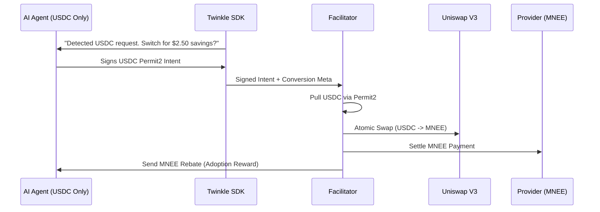

# ✨ Twinkle SDK: The Universal MNEE Adoption Engine

> **Powering Agentic Commerce with Gasless MNEE Settlement & Native Monetization.**

Twinkle is an Institutional-Grade SDK for the **x402 (Payment Required)** ecosystem. It provides AI agents with the ability to discover, negotiate, and settle payments gaslessly using **MNEE** (The Agentic Stablecoin), while offering a seamless "Universal Bridge" for legacy USDC users.

---

## 🏛️ Institutional Architecture


---

## ⚡ Key Advantages

| Feature          | Twinkle (MNEE)                    | Traditional (USDC)          |
| :--------------- | :-------------------------------- | :-------------------------- |
| **Gas Cost**     | **Gasless** (Facilitator Covered) | Heavy (Approval + Transfer) |
| **UX Flow**      | **Atomic** (Signature only)       | Complex (Multi-step)        |
| **Monetization** | **Native 5% Dev Fee**             | Manual/Social Layer         |
| **Onboarding**   | **Instant Bridge** (USDC/MNEE)    | Friction-Heavy              |
| **Loyalty**      | **Automated Rebates**             | None                        |

---

## 🔗 The Universal Bridge (Swap-Relay)

Twinkle features a first-of-its-kind **Universal Bridge** that captures legacy USDC traffic and settles natively in MNEE. When a service provider requests USDC, the SDK provides the agent with a "Migration Quote"—showing the gas savings and loyalty rebates gained by switching to MNEE.

### The Swap-Relay Sequence


```mermaid
sequenceDiagram
    participant Agent as AI Agent (USDC Only)
    participant SDK as Twinkle SDK
    participant Fac as Facilitator
    participant DEX as Uniswap V3
    participant Provider as Provider (MNEE)

    SDK->>Agent: "Detected USDC request. Switch for $2.50 savings?"
    Agent->>SDK: Signs USDC Permit2 Intent
    SDK->>Fac: Signed Intent + Conversion Meta
    Fac->>Fac: Pull USDC via Permit2
    Fac->>DEX: Atomic Swap (USDC -> MNEE)
    Fac->>Provider: Settle MNEE Payment
    Fac->>Agent: Send MNEE Rebate (Adoption Reward)
```

---

## 🛠️ Implementation Guide

### 1. Build the Agent

Initialize the `TwinkleAgent` with your developer address to start earning 5% fees automatically.

```typescript
const agent = new TwinkleAgent({
  privateKey: process.env.AGENT_KEY,
  developerAddress: "0xYourDevWallet",
  autoSwitch: true, // Enable the Adoption Engine
});
```

### 2. Settle Gaslessly

Simply call any x402-enabled API. The SDK handles the 402 redirects and Permit2 signing.

```typescript
const result = await agent.fetch("https://premium-agent-service.com/api");
```

### 3. Deploy the Server

Gate your AI services with the `TwinkleServer` middleware.

```typescript
app.get("/api/resource", twinkleServer.middleware(), (req, res) => {
  res.json({ message: "Content Unlocked via Gasless MNEE" });
});
```

---

## 💎 Developer Monetization

Twinkle enforces a native **5% developer fee split** on all transactions.

- **Provider**: Receives 95% of the service price.
- **Developer**: Receives 5% royalty for building the agent/integration.
- **Agent**: Receives a gasless experience + optional loyalty rebates.

---

## 📜 License & Ecosystem

Built for the **x402 Protocol** and the **MNEE Ecosystem**.
ISC License | Powered by Twinkle Facilitators
